<p align="center">
  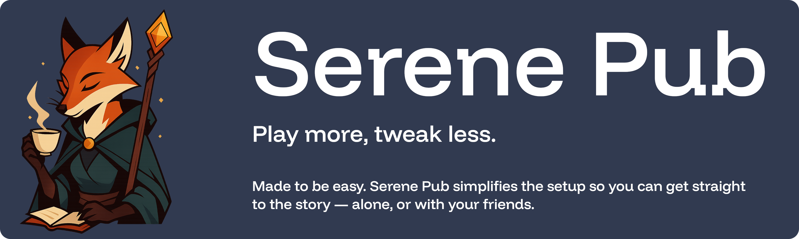
</p>

> **⚠️ Serene Pub is in beta! Expect bugs and rapid changes. This project is under heavy development.**

<p align="center">
  <b><a href="https://serenepub.com">🌐 Website</a> •
  <a href="docs/">📚 Documentation</a> •
  <a href="https://github.com/doolijb/serene-pub/releases">⬇️ Downloads</a> •
  <a href="https://github.com/doolijb/serene-pub/issues">🐛 Issues</a> •
  <a href="https://discord.gg/3kUx3MDcSa">💬 Discord</a> •
  <a href="https://buymeacoffee.com/serenepub">☕ Buy Me a Coffee</a></b>
</p>

---

# 🦊 Serene Pub

**Modern, Open Source AI Roleplay Chat**

**Play more, tweak less.**

Serene Pub is an open source chat app for AI roleplay and creative writing, built for stories that hold together over the long run. It remembers what happened, keeps every character honest about what they know, and lets you share the story with friends. Run it on your own hardware or point it at any AI provider.

**Never run an LLM before? You don't need to know how.** The Setup Wizard downloads, installs and runs a local model for you in a few clicks. No terminal, nothing to configure by hand. Prefer a hosted provider? Plug in an API key.

<p align="center">
  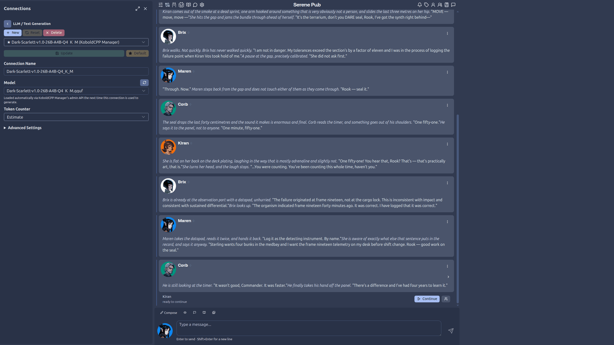
</p>

Long stories drift. Characters forget what happened chapters ago, secrets slip to people who were never in the room, and playing with friends means passing a browser tab around. Serene Pub fixes those three things: structured memory that grows with the story, characters who only act on what they've seen, and a server you can share.

---

## Table of Contents

- [Multiplayer](#-multiplayer)
- [Screenshots](#-screenshots)
- [Features](#-features)
- [Is Serene Pub Right For You?](#-is-serene-pub-right-for-you)
- [Platforms](#-platforms)
- [Quick Start](#-quick-start)
- [Docker](#-docker)
- [Documentation](#-documentation)
- [Roadmap](#-roadmap)
- [Contributing](#-contributing)
- [License](#-license)
- [Special Thanks](#-special-thanks)

---

## 🤝 Multiplayer

Most AI roleplay tools are built for one person in one browser tab. Serene Pub isn't.

Turn on multi-user accounts and one server becomes a shared instance. Invite a friend into a chat as a guest and they arrive as themselves, with their own persona and their own characters pulled from their own library.

- **Multi-tenant accounts** — each account's characters, personas, chats and lorebooks stay private to it
- **Guests bring their own cast** — friends join with their own persona and characters
- **Live, not turn-passing** — every message, edit and generation syncs to everyone over WebSockets

<p align="center">
  <a href="docs-assets/screenshots/multiplayer-session.png">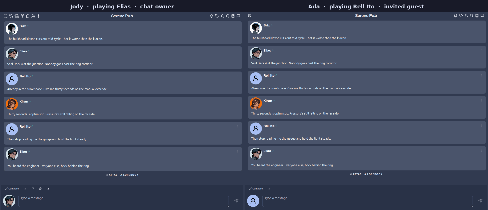</a>
  <br/><sub>One scene, two accounts, live. The owner (left) and an invited guest (right) each bring their own persona; every message syncs to both.</sub>
</p>

---

## 🖼️ Screenshots

<sub>Click any image for full size. Shots use the community-library cast aboard *Seraphis Station*, generated locally via the KoboldCPP Manager.</sub>

### 💬 Chatting

<table>
<tr>
<td width="50%" align="center" valign="top">
  <a href="docs-assets/screenshots/home.png">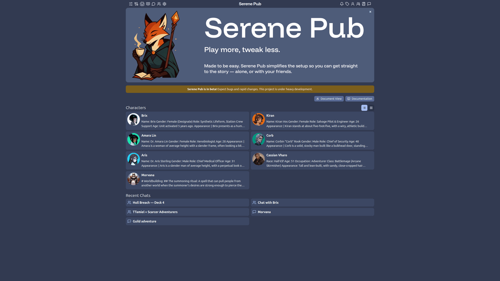</a>
  <br/><sub><b>Home</b><br/>Your cast and recent chats, one click from picking up where you left off.</sub>
</td>
<td width="50%" align="center" valign="top">
  <a href="docs-assets/screenshots/characters-sidebar-cards.png">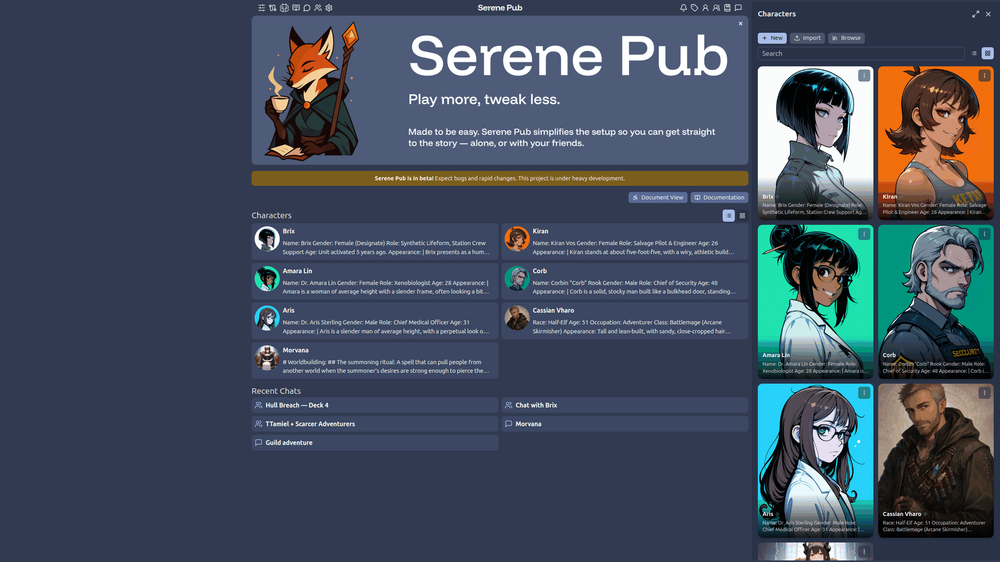</a>
  <br/><sub><b>Character Library</b><br/>The characters sidebar in card view — full art, searchable, open alongside whatever you're doing.</sub>
</td>
</tr>
<tr>
<td width="50%" align="center" valign="top">
  <a href="docs-assets/screenshots/chat-group.png"></a>
  <br/><sub><b>Group Chat</b><br/>As many characters as you like, replying in drag-to-reorder turn order.</sub>
</td>
<td width="50%" align="center" valign="top">
  <a href="docs-assets/screenshots/chat-participants-editor.png">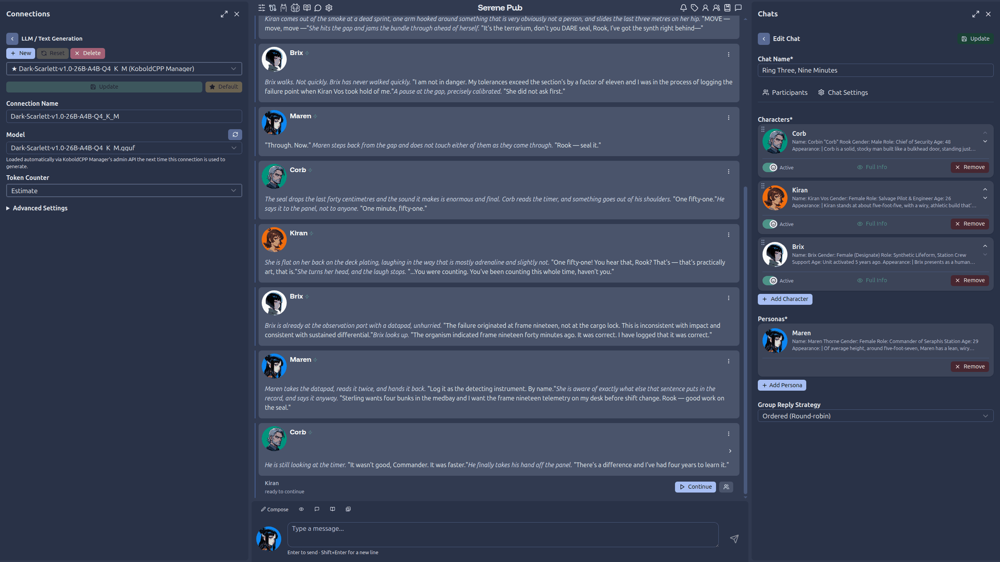</a>
  <br/><sub><b>Participants & Visibility</b><br/>Add cast mid-scene, reorder turns, set Full / Minimal / Hidden per character.</sub>
</td>
</tr>
<tr>
<td width="50%" align="center" valign="top">
  <a href="docs-assets/screenshots/chat-one-on-one.png">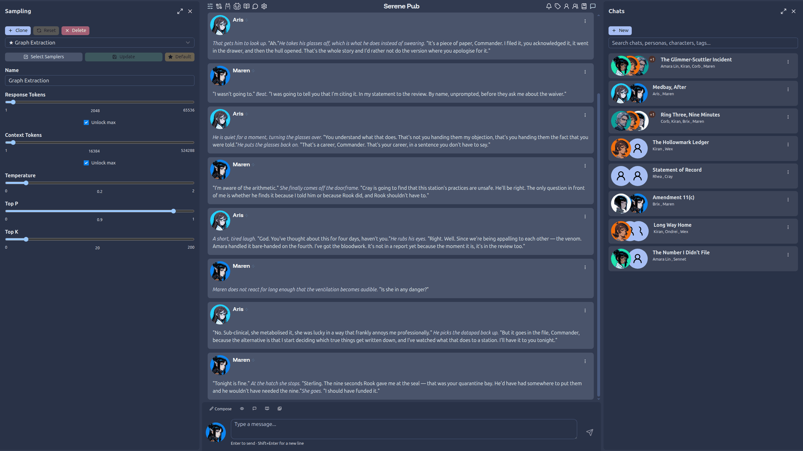</a>
  <br/><sub><b>One-on-One</b><br/>Just you and one character, with your chat library alongside.</sub>
</td>
<td width="50%" align="center" valign="top">
  <a href="docs-assets/screenshots/chat-message-actions.png">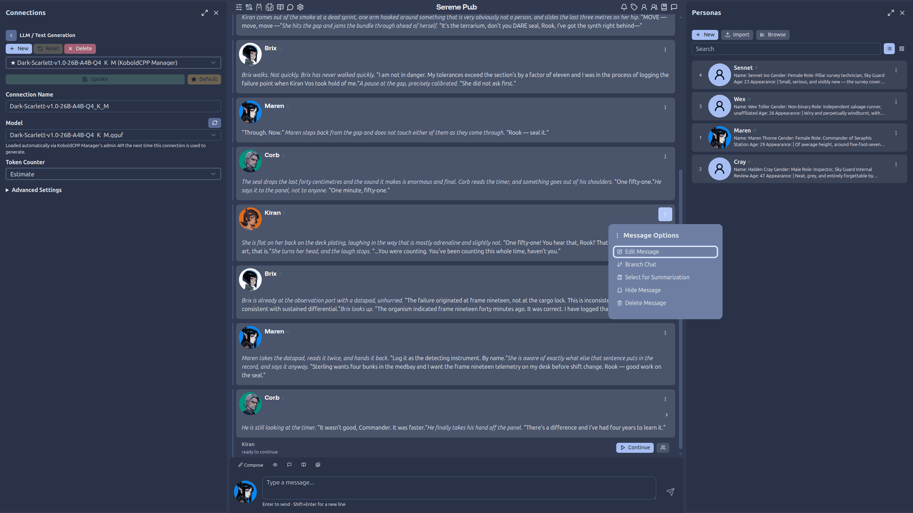</a>
  <br/><sub><b>Message Actions</b><br/>Edit, branch, summarize, hide or delete any message.</sub>
</td>
</tr>
</table>

### 🧠 Memory & Worldbuilding — Lorebooks+

<table>
<tr>
<td width="33%" align="center" valign="top">
  <a href="docs-assets/screenshots/lorebook-world-lore.png">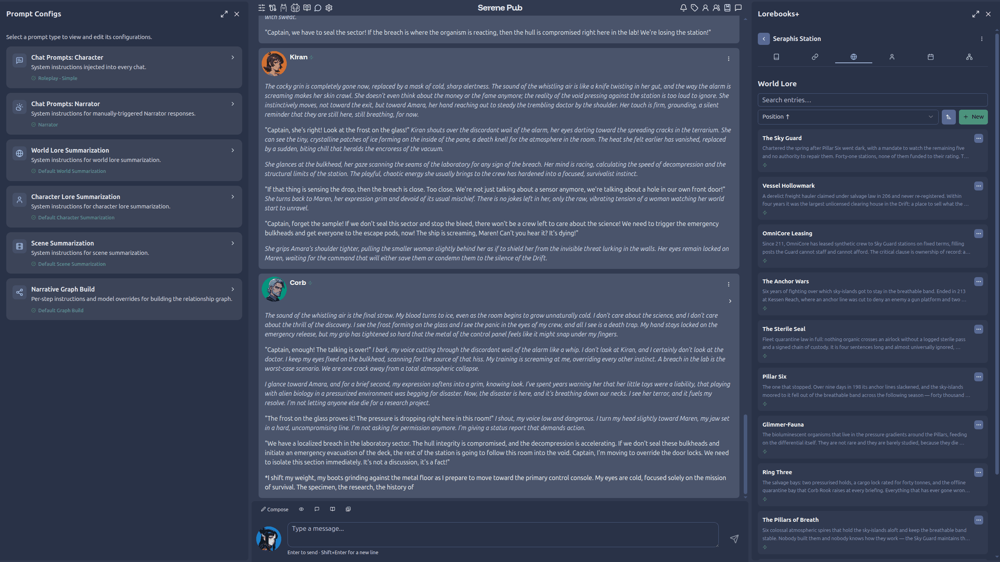</a>
  <br/><sub><b>World Lore</b><br/>Facts about your setting, retrieved when they matter.</sub>
</td>
<td width="33%" align="center" valign="top">
  <a href="docs-assets/screenshots/lorebook-character-lore.png">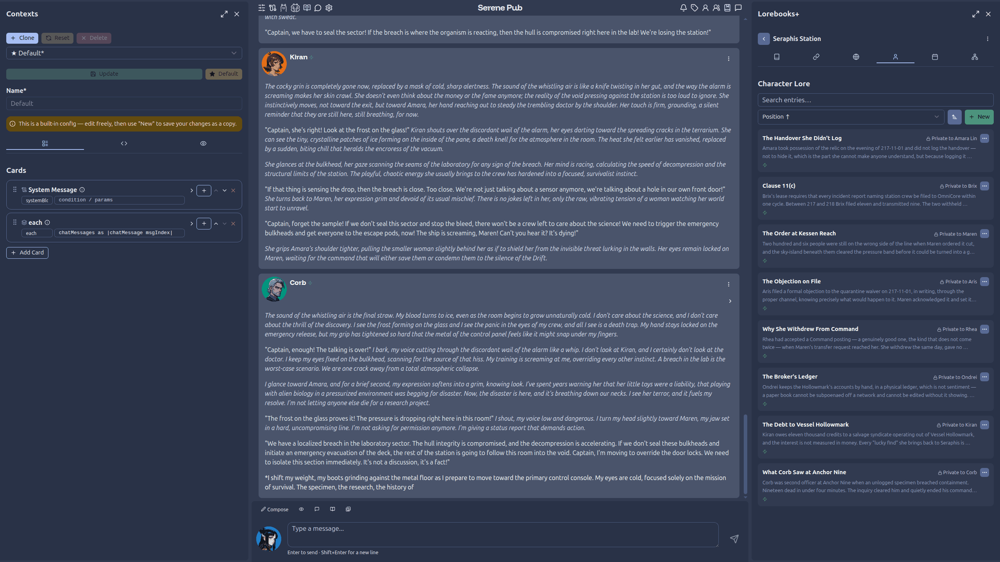</a>
  <br/><sub><b>Character Lore</b><br/>Scoped to one character. <i>“Private to Kiran”</i> stays private.</sub>
</td>
<td width="33%" align="center" valign="top">
  <a href="docs-assets/screenshots/lorebook-history.png">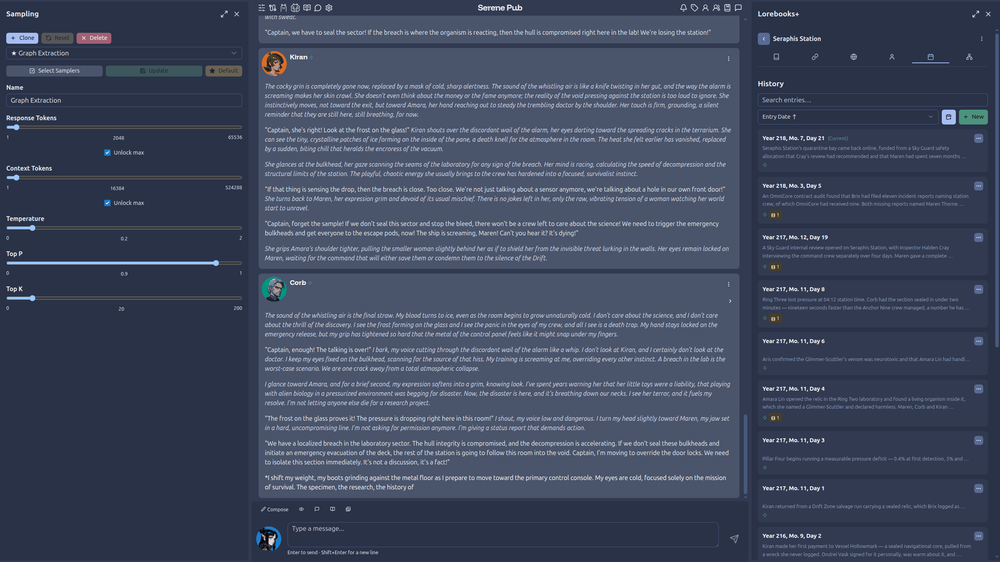</a>
  <br/><sub><b>History Timeline</b><br/>Dated in-world events, with a marker for “now”.</sub>
</td>
</tr>
<tr>
<td width="33%" align="center" valign="top">
  <a href="docs-assets/screenshots/lorebook-bindings.png">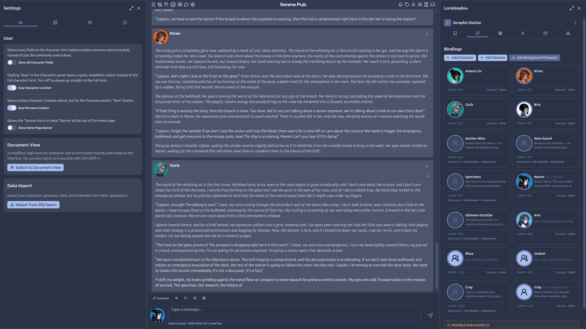</a>
  <br/><sub><b>Bindings</b><br/>Bind your cast to <code>{{char:N}}</code> tokens, usable in every entry.</sub>
</td>
<td width="33%" align="center" valign="top">
  <a href="docs-assets/screenshots/graph-aggregated.png">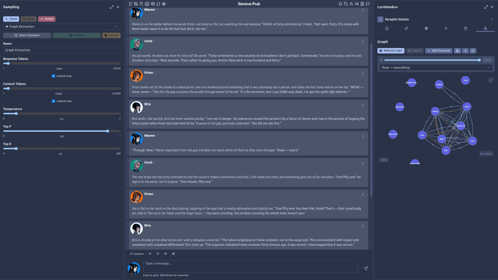</a>
  <br/><sub><b>Narrative Graph</b><br/>Who knows whom, and how. Replies come from each character’s vantage point.</sub>
</td>
</tr>
<tr>
<td width="33%" align="center" valign="top">
  <a href="docs-assets/screenshots/graph-node-focused.png">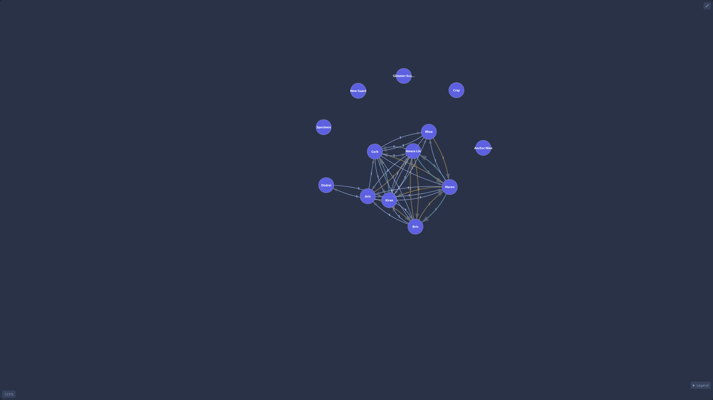</a>
  <br/><sub><b>Graph Traversal</b><br/>Select anyone to isolate the ties they hold.</sub>
</td>
<td width="33%" align="center" valign="top">
  <a href="docs-assets/screenshots/graph-relationships-list.png">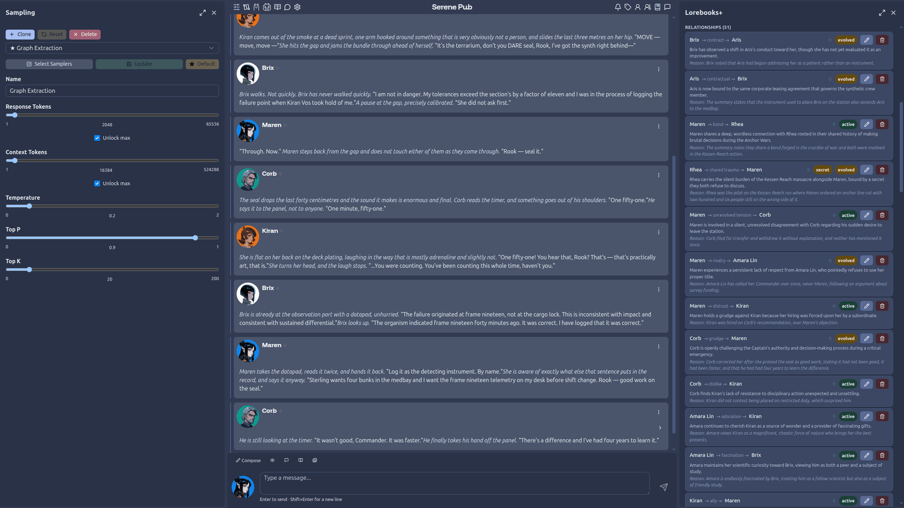</a>
  <br/><sub><b>Relationships</b><br/>Every edge cites its source. Review before anything saves.</sub>
</td>
<td width="33%" align="center" valign="top">
  <a href="docs-assets/screenshots/setup-wizard-embeddings.png">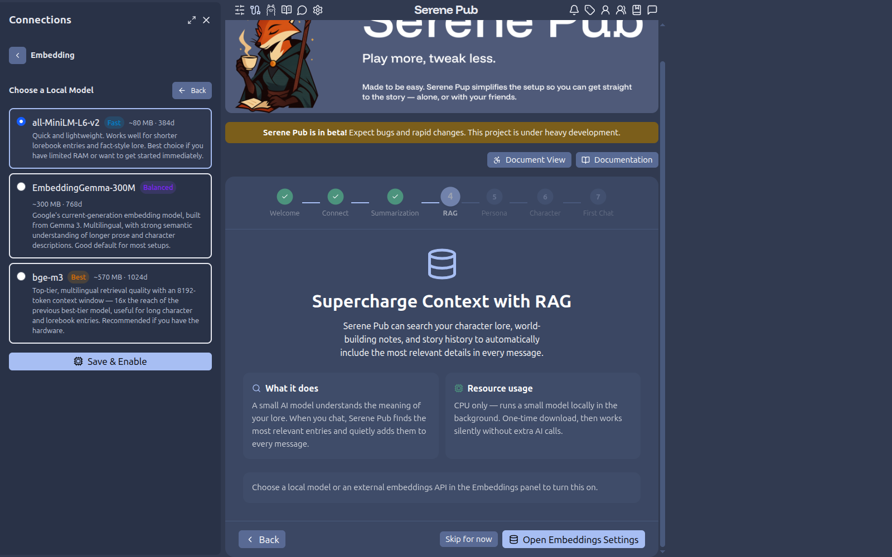</a>
  <br/><sub><b>Long-Term Memory (RAG)</b><br/>Pick a local embedding model, or any OpenAI-compatible endpoint.</sub>
</td>
</tr>
</table>

### 🖥️ Local Models, No Terminal

<table>
<tr>
<td width="25%" align="center" valign="top">
  <a href="docs-assets/screenshots/connections-koboldcpp-available.png">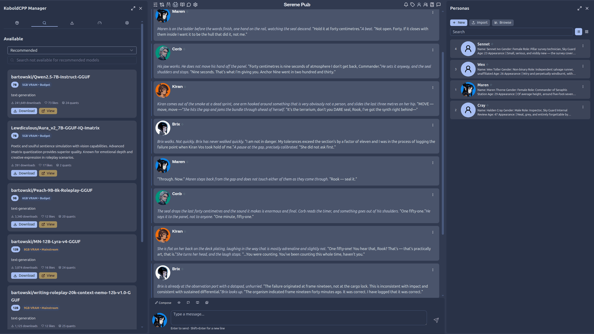</a>
  <br/><sub><b>KoboldCPP — Get the Binary</b><br/>Pick a build; Serene Pub downloads and runs it.</sub>
</td>
<td width="25%" align="center" valign="top">
  <a href="docs-assets/screenshots/connections-koboldcpp-models.png"></a>
  <br/><sub><b>KoboldCPP — Models</b><br/>Browse, download and switch GGUF models.</sub>
</td>
<td width="25%" align="center" valign="top">
  <a href="docs-assets/screenshots/connections-koboldcpp-settings.png">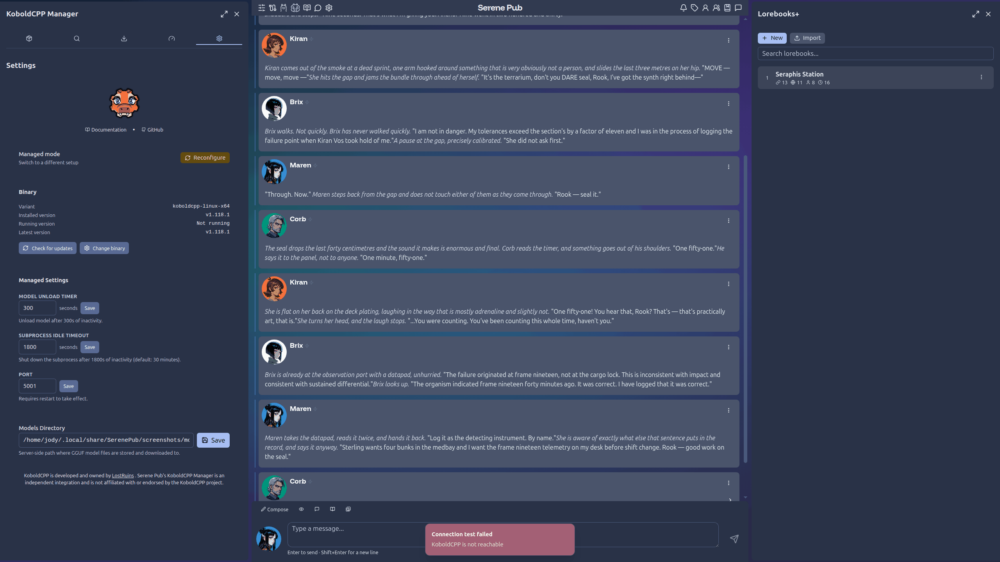</a>
  <br/><sub><b>KoboldCPP — Managed Mode</b><br/>Version, port, unload timers and capabilities at a glance.</sub>
</td>
<td width="25%" align="center" valign="top">
  <a href="docs-assets/screenshots/connections-ollama-manager.png">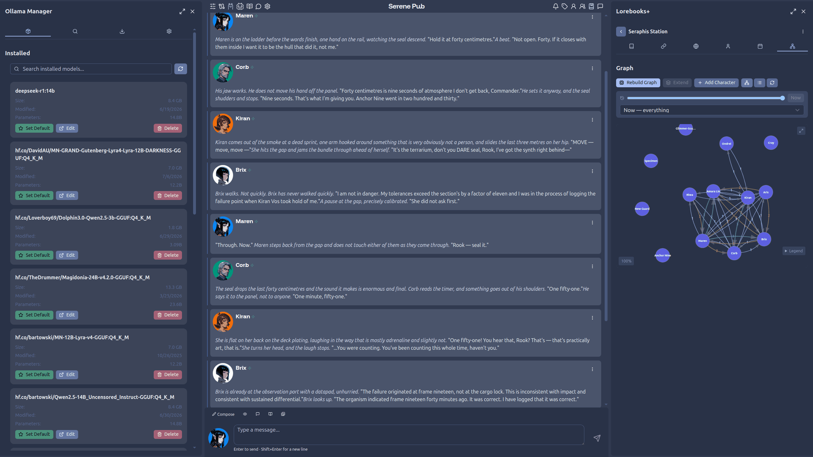</a>
  <br/><sub><b>Ollama Manager</b><br/>Search, download and activate Ollama models in-app.</sub>
</td>
</tr>
</table>

### 📚 Community Libraries

<table>
<tr>
<td width="33%" align="center" valign="top">
  <a href="docs-assets/screenshots/library-characters.png">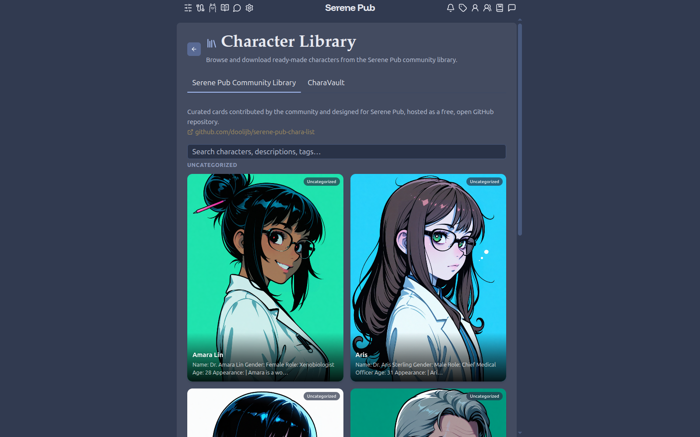</a>
  <br/><sub><b>Character Library</b><br/>Browse and import community cards, including CharaVault.</sub>
</td>
<td width="33%" align="center" valign="top">
  <a href="docs-assets/screenshots/library-personas.png">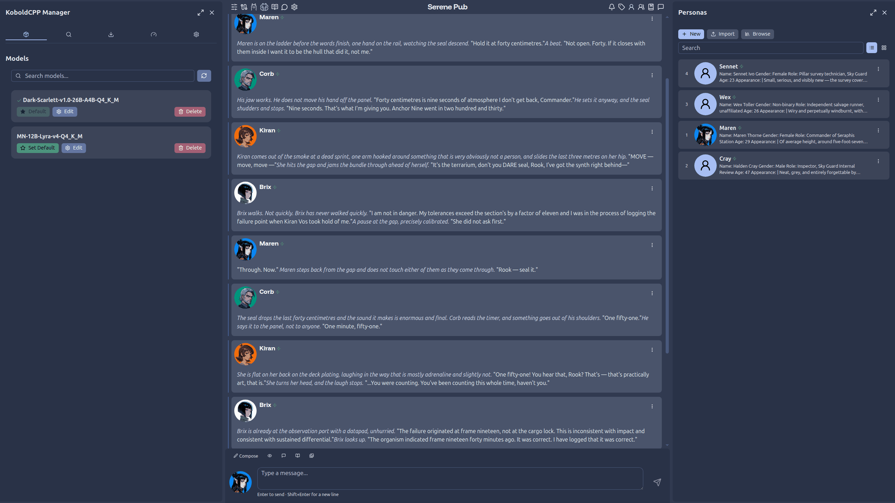</a>
  <br/><sub><b>Persona Library</b><br/>Ready-made personas for however you want to show up.</sub>
</td>
<td width="33%" align="center" valign="top">
  <a href="docs-assets/screenshots/connections-configured.png">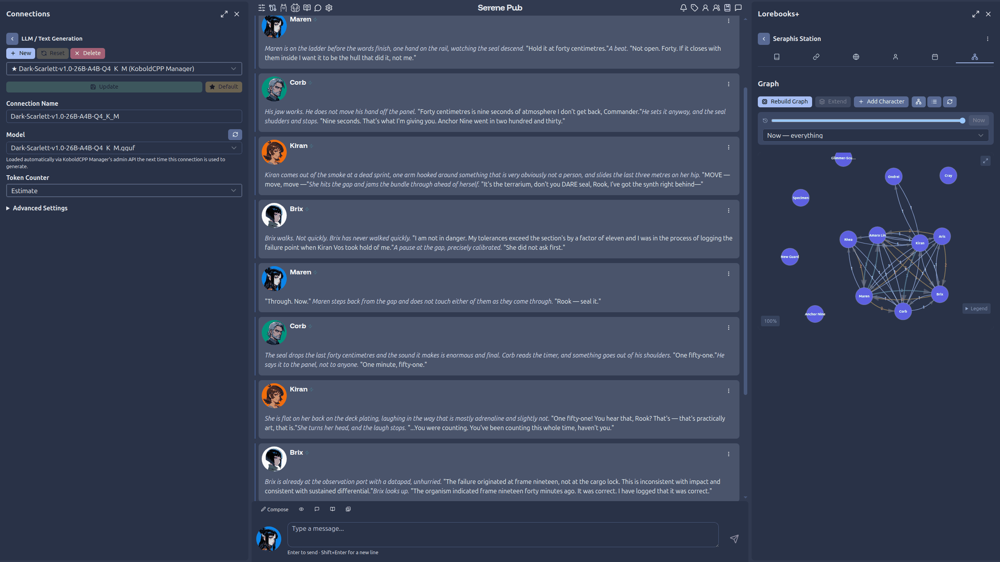</a>
  <br/><sub><b>Connections</b><br/>Any provider, per-task overrides, sampling and context configs.</sub>
</td>
</tr>
</table>

### ⚙️ Prompts & Context Control

<table>
<tr>
<td width="50%" align="center" valign="top">
  <a href="docs-assets/screenshots/config-context-template.png">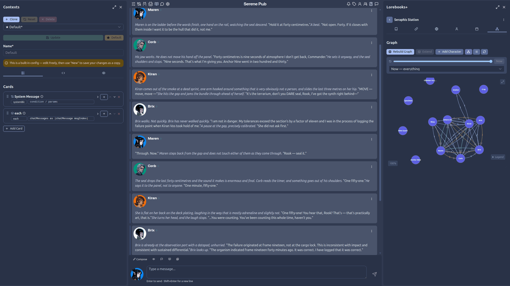</a>
  <br/><sub><b>Context Config Builder</b><br/>Build the prompt from reorderable cards, or edit the raw template.</sub>
</td>
<td width="50%" align="center" valign="top">
  <a href="docs-assets/screenshots/config-prompt-configs.png">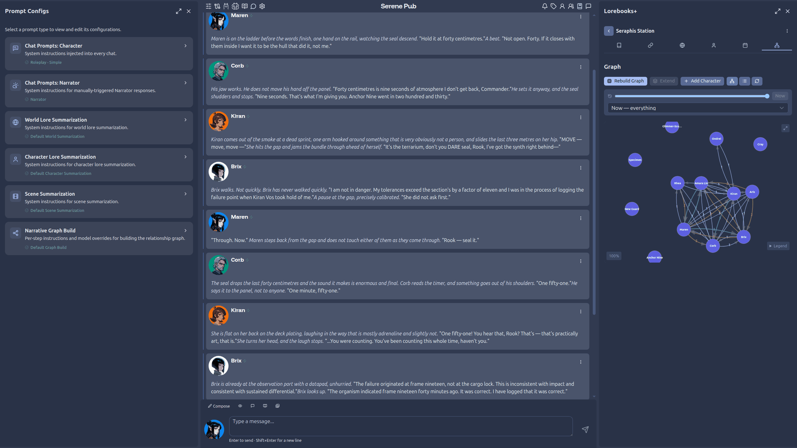</a>
  <br/><sub><b>Per-Task Prompt Configs</b><br/>Chat, narrator, summarizers and graph builder each get their own model.</sub>
</td>
</tr>
</table>

### 🚀 First Run

<table>
<tr>
<td width="33%" align="center" valign="top">
  <a href="docs-assets/screenshots/setup-wizard-welcome.png">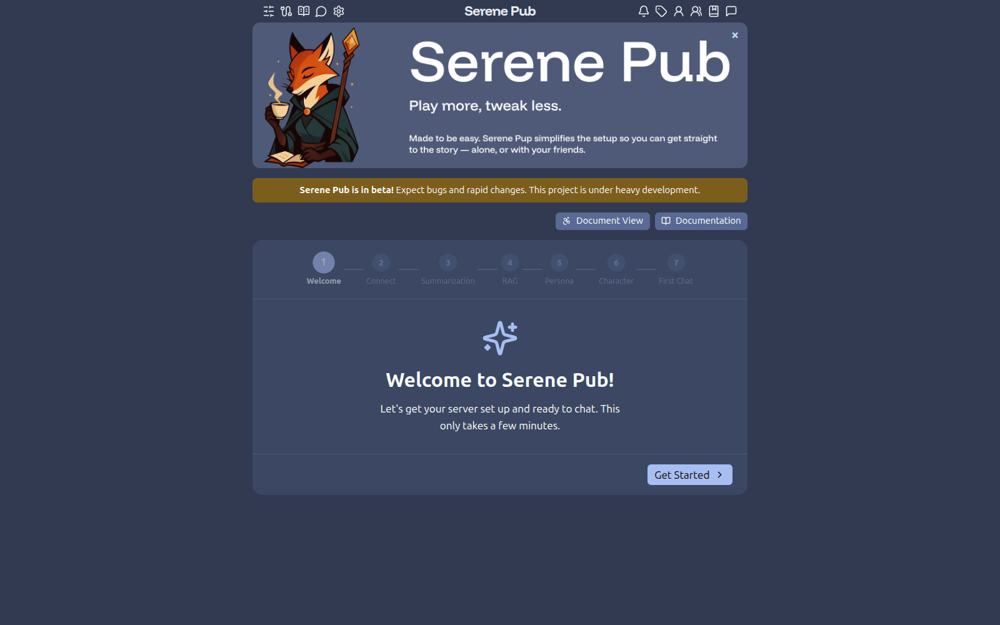</a>
  <br/><sub><b>Setup Wizard</b><br/>Seven guided steps from empty install to first chat.</sub>
</td>
<td width="33%" align="center" valign="top">
  <a href="docs-assets/screenshots/setup-wizard-connect.png">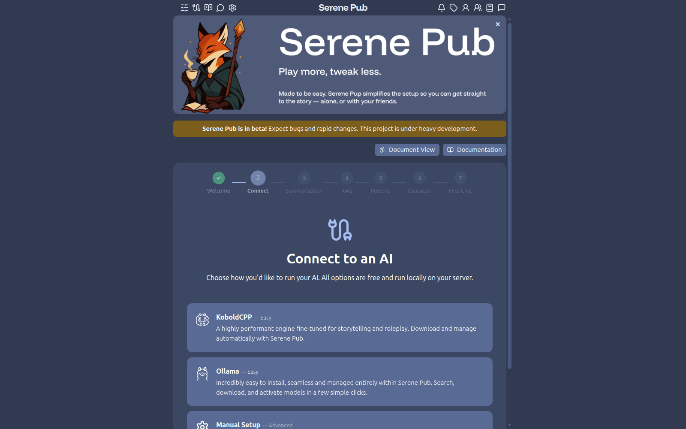</a>
  <br/><sub><b>Connect an AI</b><br/>Never run a model before? Pick “Easy” and it’s handled.</sub>
</td>
<td width="33%" align="center" valign="top">
  <a href="docs-assets/screenshots/document-view.png">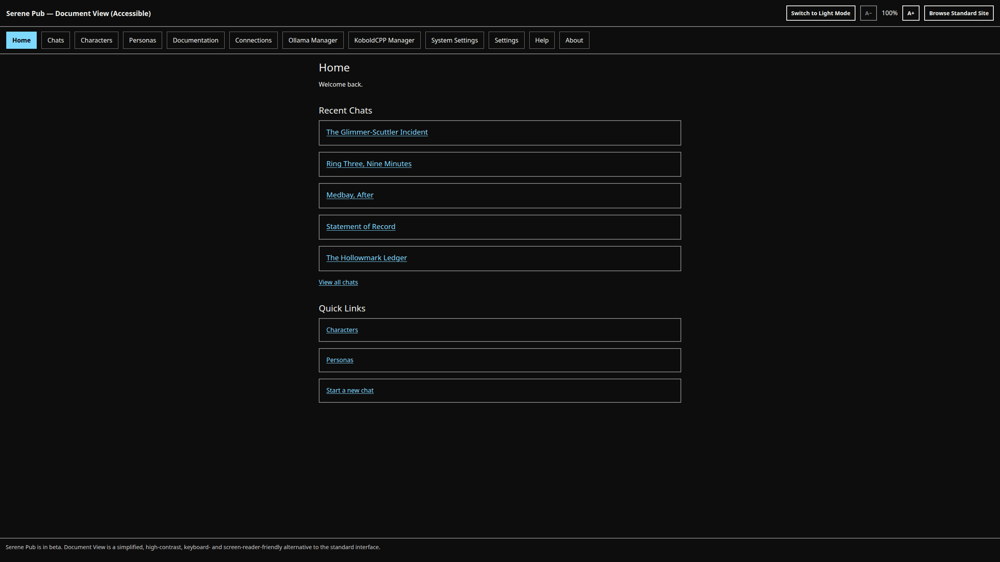</a>
  <br/><sub><b>Document View</b><br/>High-contrast, keyboard/screen-reader-first UI. <code>Ctrl+Shift+Y</code>.</sub>
</td>
</tr>
</table>

### 🎨 Themes, Backgrounds & Mobile

<table>
<tr>
<td width="25%" align="center" valign="top">
  <a href="docs-assets/screenshots/theme-catppuccin.png">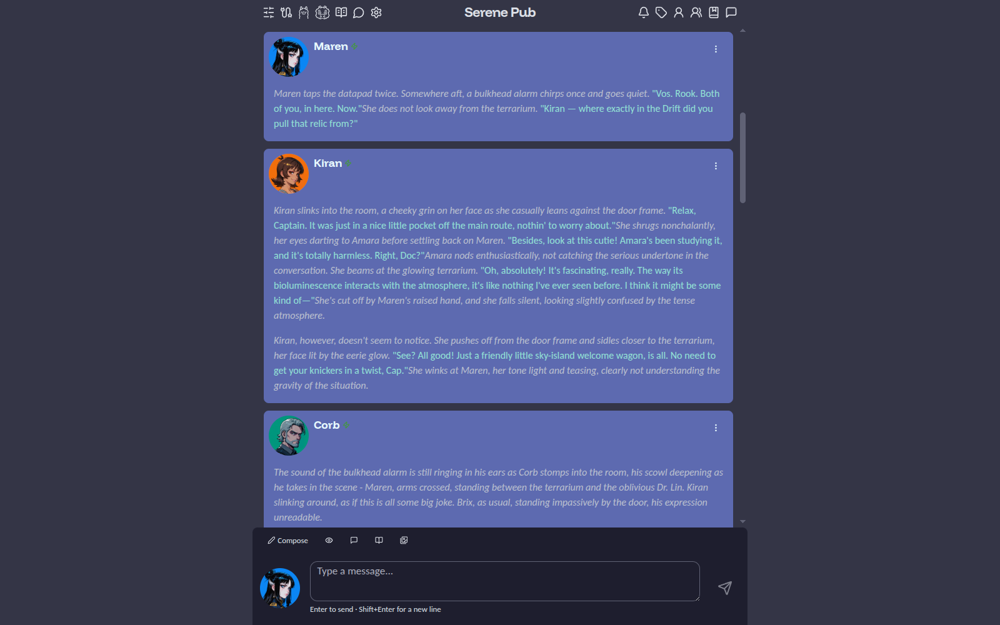</a>
  <br/><sub><b>Catppuccin</b></sub>
</td>
<td width="25%" align="center" valign="top">
  <a href="docs-assets/screenshots/theme-vintage.png">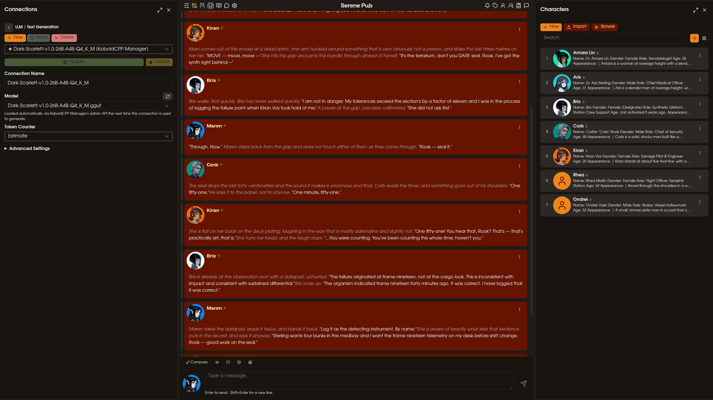</a>
  <br/><sub><b>Vintage</b></sub>
</td>
<td width="25%" align="center" valign="top">
  <a href="docs-assets/screenshots/theme-wintry-light.png">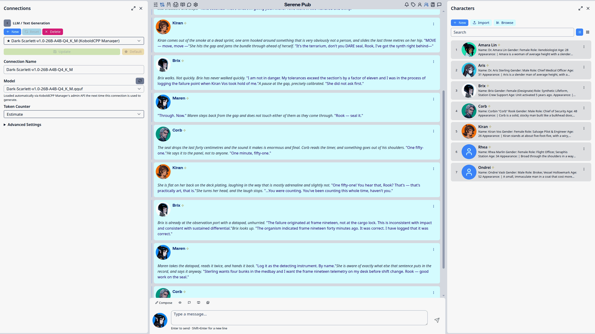</a>
  <br/><sub><b>Wintry (Light)</b></sub>
</td>
<td width="25%" align="center" valign="top">
  <a href="docs-assets/screenshots/mobile-chat.png">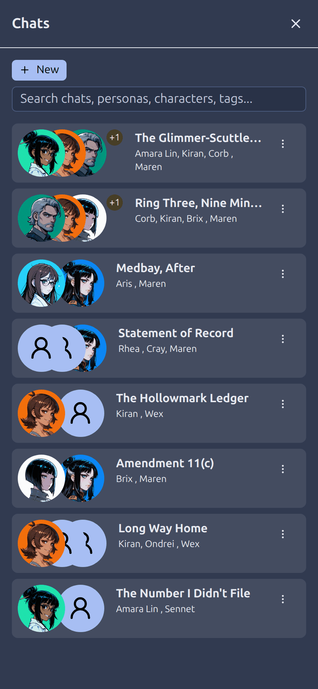</a>
  <br/><sub><b>Mobile</b><br/>Same app, fully responsive.</sub>
</td>
</tr>
<tr>
<td width="50%" colspan="2" align="center" valign="top">
  <a href="docs-assets/screenshots/chat-background-photo.png">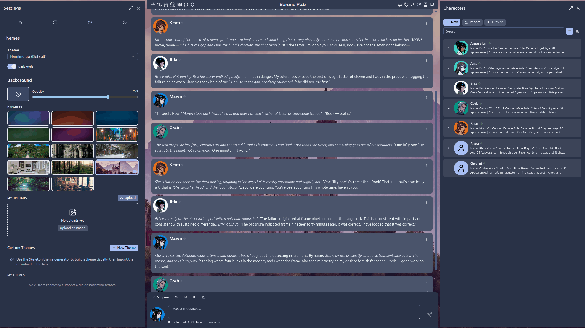</a>
  <br/><sub><b>Custom Backgrounds</b><br/>Pick a built-in image or upload your own, then set the opacity.</sub>
</td>
<td width="50%" colspan="2" align="center" valign="top">
  <a href="docs-assets/screenshots/chat-background-gradient.png">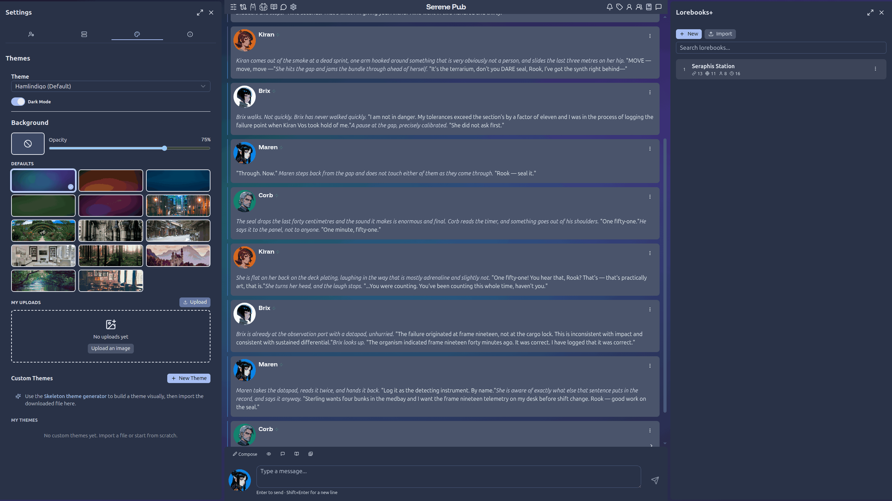</a>
  <br/><sub><b>Gradients</b><br/>If a photo is more than you want behind the text.</sub>
</td>
</tr>
</table>

<sub>Three of the 20+ built-in themes. A custom theme editor ships too.</sub>

---

## 🚀 Features

### Memory & Worldbuilding

A story that remembers itself, so you don't have to keep notes.

- **Lorebooks+:** World lore, character lore and a dated history timeline, all bindable to your cast via `{{char:N}}` tokens
- **Scenes:** Capture a run of chat messages as a standalone summary, pinned to a point in your story's history
- **Summarization:** Compress chat messages, scenes and history entries into permanent, editable lorebook content on demand
- **Narrative Graph:** Tracks who is connected to whom, and how. Build it from your scenes and history, then extend it as the story grows
- **Relationship Visibility:** Every relationship is secret, acknowledged or public, and replies come from each character's own vantage point. A one-sided crush stays one-sided
- **Long-Term Memory (RAG):** Finds lore, history and past messages by meaning rather than keywords, scoped to what each character knows. Runs on-device or against any OpenAI-compatible embeddings API

### Characters & Perspective

- **Character & Persona Management:** Import, create and edit with rich metadata, avatars and image galleries
- **Library Browsers:** Search and import thousands of community-made cards without leaving the app, including direct **CharaVault** integration
- **Per-Character Visibility:** Full / Minimal / Hidden per character, per chat. A context-budget control, separate from relationship secrecy
- **On-Demand Narrator:** Trigger a response from the environment (weather, scenery, an NPC shopkeeper) with no permanent "Narrator" in your cast
- **Group Chats:** As many characters at once as you like, with drag-to-reorder round-robin turn order
- **Branch Chat:** Fork the story at any message into a full copy, carrying the cast, lorebook, settings and history up to that point. Any participant can branch
- **Built for Coherence:** Character and lore data reaches the model structured, not as freeform prose. A deliberate choice after side-by-side testing

### AI Connections & Local Models

Bring your own model, or download and run one from inside the app.

- **AI Model Agnostic:** OpenAI, Anthropic, Ollama, llmman, KoboldCPP, LM Studio, Llama.cpp and more
- **KoboldCPP Manager:** Download the binary, browse and download GGUF models, load or switch between them, all in-app
- **Ollama Manager:** Search, download and activate Ollama models from a built-in UI. No command line
- **Per-Task AI Override:** Point chat, narrator and summarizer at different connections. Run dialogue on a fast local model, summarization on a heavyweight cloud one
- **Context Config Builder:** Decide what the model sees and in what order, with drag-and-drop cards and a live preview. The raw Handlebars template is still there
- **Prompt Statistics & Context Debugging:** Inspect the compiled prompt and retrieval diagnostics behind any reply, so "why did it forget that" has an answer

### Getting Started & Polish

- **Mobile-First Design:** Fully responsive on phones and tablets. See [Platforms](#-platforms) for desktop, Docker and Android builds
- **Setup Wizard:** A guided first run that can install and start a model for you, then walks you through your first character, persona and chat
- **Built-In Docs Browser:** The full documentation, searchable, inside the app
- **Document View:** A high-contrast, keyboard- and screen-reader-friendly interface with one plain page per feature. `Ctrl+Shift+Y`
- **Themes & Dark Mode:** 20+ built-in themes, instant switching, accessibility options, and an editor for building and sharing your own
- **Custom Backgrounds:** Put an image behind the interface, built-in or your own, with an opacity slider. Per-account, so everyone on a server gets their own
- **Tags:** Organize and filter chats, characters, personas and lorebooks
- **Chat & Context Tools:** Auto response, message editing, streaming and regenerate, hidden responses, swipe between alternatives, live token stats
- **Portable & Secure:** Embedded database, no cloud required, runs anywhere
- **SillyTavern Import/Export:** Import cards and avatars, or a whole SillyTavern data directory with chat history. Exports in the same format

---

## 🤔 Is Serene Pub Right For You?

- **Already have a character library?** SillyTavern cards import directly, or point Serene Pub at a whole data directory for characters and chat history at once.
- **Want to play with friends?** Multi-user accounts and guest-invited chats, self-hosted end to end. Everyone plays their own persona and brings their own characters onto a server you control.
- **Writing long-form solo?** Lorebooks+, Summarization and the Narrative Graph keep characters and world facts straight well past where flat lorebooks break down.

---

## 🧩 Platforms

The core app is the same everywhere. Two features depend on native binaries that don't exist for every platform, and the app says so up front rather than failing at runtime.

| Platform | Distribution | Local embedding models | KoboldCPP / Ollama Manager |
| --- | --- | --- | --- |
| 🪟 Windows (x64) | [GitHub Release](https://github.com/doolijb/serene-pub/releases) `.zip` | ✅ | ✅ |
| 🍎 macOS — Apple Silicon (arm64) | [GitHub Release](https://github.com/doolijb/serene-pub/releases) `.zip` | ✅ | ✅ |
| 🍎 macOS — Intel (x64) | [GitHub Release](https://github.com/doolijb/serene-pub/releases) `.zip` | ⚠️ Unavailable¹ | ✅ |
| 🐧 Linux (x64) | [GitHub Release](https://github.com/doolijb/serene-pub/releases) `.zip` | ✅ | ✅ |
| 🐧 Linux (arm64) | Docker only² | ✅ | ✅ |
| 🐳 Docker (`linux/amd64`, `linux/arm64`) | [ghcr.io/doolijb/serene-pub](https://github.com/doolijb/serene-pub/pkgs/container/serene-pub) | ✅ | ✅ |
| 📱 Android (arm64, API 26+) | [GitHub Release](https://github.com/doolijb/serene-pub/releases) `.apk` | ⚠️ Unavailable³ | ⚠️ Unavailable⁴ |

**Annotations:**

1. **macOS Intel — no local embedding models**: `onnxruntime-node`, which powers in-app embeddings, stopped shipping Intel Mac binaries at v1.24.3. Use any OpenAI-compatible `/embeddings` endpoint instead, which behaves identically. The Docker image keeps full local support, since the container runs Linux binaries.
2. **Linux arm64 — Docker only**: GitHub-hosted CI runners can't cross-compile the native dependencies, so there's no standalone desktop build. The multi-arch Docker image covers this architecture with the full feature set.
3. **Android — no local embedding models**: Android's Bionic userspace isn't glibc-compatible and `onnxruntime-node` requires glibc. Not fixable by packaging. Use an external embeddings API, as on Intel Mac.
4. **Android — no KoboldCPP/Ollama Manager**: the *managed* auto-download-and-run modes are hidden, since KoboldCPP publishes no Linux arm64 binary. **Connecting to a remote KoboldCPP or Ollama server still works**, via the Connections panel.

See [`android/README.md`](android/README.md) for all Android-specific constraints.

---

## 🛠️ Quick Start

No config files, no build step, no separate services to wire up.

| Platform | Get Serene Pub |
| --- | --- |
| 🪟 **Windows** | [Download](https://github.com/doolijb/serene-pub/releases) → extract → run `run.cmd` |
| 🍎 **macOS** | [Download](https://github.com/doolijb/serene-pub/releases) → extract → run `run.sh` (first launch may need right-click → Open; see [Troubleshooting](docs/troubleshooting.md)) |
| 🐧 **Linux** | [Download](https://github.com/doolijb/serene-pub/releases) → extract → run `run.sh` (`install-desktop-shortcut.sh` adds a desktop icon) |
| 📱 **Android** | [Download the APK](https://github.com/doolijb/serene-pub/releases) → install → open |
| 🐳 **Docker** | `docker compose -f docker-compose.dist.yml up -d` — see [Docker](#-docker) below |

Desktop opens at [http://localhost:3000](http://localhost:3000); Android opens straight into the app. The **Setup Wizard** connects an AI provider (or installs KoboldCPP/Ollama for you), then walks you through your first character, persona and chat.

### From Source

#### Requirements

- [Node.js](https://nodejs.org/en) 24 or later
- (Optional) [Ollama](https://ollama.com/download) for local models

#### Steps

1. Clone this repo
2. `npm i` to install dependencies
3. `npm run dev` to start the dev server, or `npm run dev:host`
4. Visit [http://localhost:5173](http://localhost:5173)

Prefer Docker? `docker compose -f docker-compose.dev.yml up -d --build` builds from local source into its own data volume, for testing changes without touching the release image.

## 🐳 Docker

Pre-built images are published to the GitHub Container Registry on every release:

```
ghcr.io/doolijb/serene-pub:latest   ← always the latest stable release
ghcr.io/doolijb/serene-pub:0.5.0    ← exact version pin
```

**Quickstart** — download [`docker-compose.dist.yml`](docker-compose.dist.yml) from the release assets, then:

```bash
docker compose -f docker-compose.dist.yml up -d
```

The web UI will be at **http://localhost:3000**.

**Data directory** — database, model cache and uploads live under `SERENE_PUB_DATA_DIR`, defaulting to `/data` and mounted as a named volume. For a host path instead:

```bash
docker run -p 3000:3000 -p 3001:3001 \
  -e SERENE_PUB_DATA_DIR=/data \
  -v "$(pwd)/serene-pub-data":/data \
  ghcr.io/doolijb/serene-pub:latest
```

See [DOCKER.md](DOCKER.md) for ports, volumes and reverse proxies, and [Hosting Serene Pub](docs/hosting.md) or [Environment Variables](docs/environment-variables.md) for env vars and tunnels.

**Need help?** Start with the **[Getting Started guide](docs/getting-started.md)**.

---

## 📚 Documentation

### **[Complete Documentation Available in docs/](docs/)**

The same documentation ships inside the app on a built-in **Docs** page.

**Popular pages:**

- **[Getting Started](docs/getting-started.md)** - The setup wizard, step by step
- **[Connections](docs/connections.md)** - Connecting to AI models and managing local ones
- **[Characters](docs/characters.md)** and **[Personas](docs/personas.md)** - Your cast, and your own identity in a chat
- **[Lorebooks](docs/lorebooks.md)** - World-building, history, scenes and the narrative graph
- **[Embeddings & RAG](docs/embeddings-and-rag.md)** - How semantic retrieval keeps long stories coherent
- **[Prompt Configs](docs/prompt-configs.md)** and **[Context Configs](docs/connections.md#context-configs)** - Customizing prompts and the context builder
- **[Document View](docs/document-view.md)** - The accessible alternative interface
- **[Troubleshooting](docs/troubleshooting.md)** - Common issues and solutions

---

## 🗺️ Roadmap

Upcoming releases are tracked as **[GitHub Milestones](https://github.com/doolijb/serene-pub/milestones)**, each holding the issues that make it up. Nothing is promised on a timeline.

- **0.6.0** — a modular node pipeline, with core logic and AI workflows converted onto it, plus further RAG and Lorebooks+ improvements
- **0.7.0** — maturing those pipelines into an SDK for modders: custom pipelines, server-side logic, free-form data storage and limited-scope UI components

**Text-to-Speech** was targeted for 0.5.0 and held back. No integration found yet that's small, fast, expressive and tunable without voice cloning or a large sample library.

---

## ❤️ Contributing

Bug fixes, features and feedback are all welcome. Please [open an issue](https://github.com/doolijb/serene-pub/issues) or [start a discussion](https://github.com/doolijb/serene-pub/discussions) before submitting large changes.

**For development setup and contribution guidelines, see [CONTRIBUTING.md](CONTRIBUTING.md).**

---

## 🛡️ License

AGPL-3.0. See [LICENSE](LICENSE) and [NOTICE.md](NOTICE.md) for details.

---

## 🙏 Special Thanks

Special thanks to **Nivelle** for creating Serene Pub community library characters, and **subpanopticon** for feedback and testing.

---

<p align="center">
  <b>Serene Pub — Play more, tweak less. 100% open source.</b><br>
  <b>🌐 <a href="https://serenepub.com">serenepub.com</a> • 📚 <a href="docs/">Read the full documentation</a></b>
</p>
