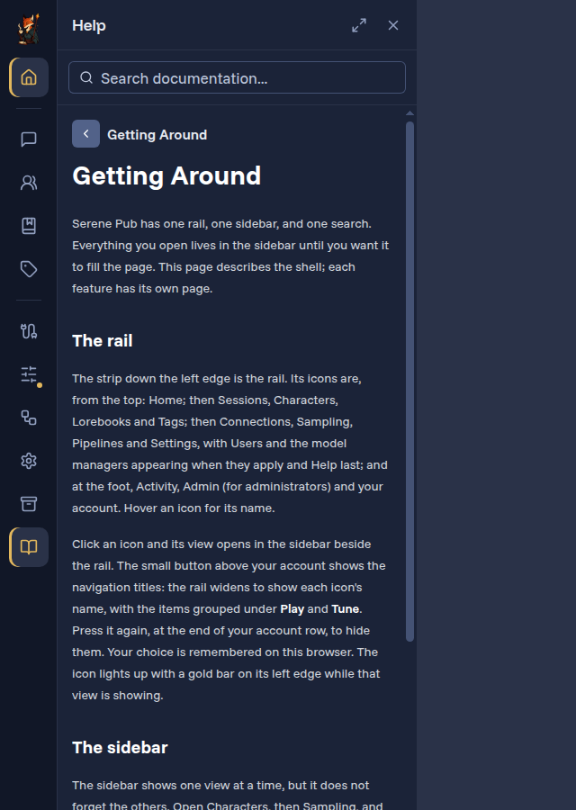

# Getting around

Serene Pub has one rail, one sidebar and one search. Everything you open sits in the sidebar beside your story until you want it to fill the window. This page is the map; each feature has its own page.

_Written for Serene Pub 0.6. This is the last step of [Start here](./getting-started.md), and a reference to come back to._

## The rail

The strip down the left edge is the **rail**. Hover an icon for its name. From the top:

- **Home**.
- **Play**: **Sessions**, **Characters**, **Lorebooks** and **Tags**, the things you make and play with.
- **Tune**: **Pipelines** and **Settings** for everyone; **Connections** and **Sampling** for administrators, and **Users** too once [accounts](./users-and-accounts.md) are on. **Help**, this documentation, is last.
- At the foot: **Activity** (your notifications), **Admin** (administrators only) and your account.

Click an icon and its **view** opens in the sidebar beside the rail; the icon gets a gold bar while its view is showing. The small button above your account widens the rail to show each icon's name, with the groups headed **Play** and **Tune**; press it again to hide them. This browser remembers your choice.

The community character [Library](./characters.md#browsing-the-character-library) has no icon of its own: open it from **Browse the library** in the Characters view.

## The sidebar

The sidebar shows one view at a time, but it doesn't forget the others. Open Characters, then Settings, and Characters keeps its scroll position, its filter and anything you were typing. A small gold dot on a rail icon means that view is still open in the background; click the icon to bring it back. Up to six views stay open this way; opening a seventh closes the one you used least recently.

Click the icon of the view you're looking at and the sidebar folds away, with the view still open behind its dot. The **×** in the sidebar's header closes a view for good and forgets its state; a view with unsaved changes asks first. After a reload the same views are open again, though not what was inside them.

## The admin area

:::note Admins only
Only administrators see the Admin icon.
:::

**Admin** opens the whole admin area as one view, like Characters or Lorebooks: dock it beside a session to change a setting while the story runs, or give it Focus to work in it. Its sections are grouped by job:

| Group | Sections |
| --- | --- |
| *(top)* | **Overview**, headed **Your pub** |
| **Models** | Defaults, Connections, Sampling |
| **People** | Users (once accounts are on), Sessions |
| **Play** | Genres, Presets |
| **Pipelines** | Pipelines, Events, Configurations, Scripts |
| **Writing** | Prompts, Context templates, Completion templates, Variable templates |
| **Extensions** | Plugins, Components |
| **Pub** | General, Network, Data and backups, Diagnostics, History ([Pub settings](./system-settings.md)) |

Docked, the view lists the sections, and picking one shows it with **All sections** to go back; in Focus the list stays beside the section. In Focus each section has its own address (`/admin/prompts`, `/admin/users/3`), so Back, bookmarks and links work.

### Lists, forms and deleting

Every section that holds many things of one kind works the same way, after the Django admin many web admins share:

- **The list** shows every one of them in a table, with a search box, **filters** (beside the table when there is room, behind the filter button when there isn't), sortable column headings and pages of 50 (**Show all** lifts that). Tick rows and use **Actions** to do something to all of them at once, such as **Delete selected**. **Add** (top right) starts a new one.
- **The form** for one item groups its fields in titled cards and ends with a save row: **Save** (back to the list), **Save and continue editing** (Ctrl+S) and **Save and add another**. Built-in items are read-only; **Duplicate** makes a copy you can change.
- **Related things the item owns are edited in the same form.** A genre's presets, for example, are a small table on the genre's page: rename one, tick **Offered**, **Add another preset** (marked _Ready to add_), or tick **Delete?** on a row, and none of it happens until you save. **Change** on a row opens that preset's own page. Related things the item doesn't own (the pipelines that use a prompt) are listed with a link to each.
- **Nothing on a form saves until you press Save** — switches, ticks and permission approvals included. The save row says _Unsaved changes_ while anything differs, leaving asks first, and Save waits for every change to be accepted before it says _Saved_. If the server refuses one, the form names it at the top and keeps it, so you can fix it and save again.
- **Deleting** always asks on its own page first. It lists everything that would go and what goes or changes with it, and names anything that stays and why: a built-in, something still in use, your own account. **No, take me back** returns you untouched.

A line of links at the top of every admin page, such as **Admin › Writing › Prompts › Reply**, says where you are. The section's link brings the list back exactly as you left it: the same search, filters, sort and page. Sections that hold one set of settings (General, Network, Defaults) are a single form instead of a list.

**Your pub** says which version is running, whether accounts are on and how long the server has been up. Its **Needs you** card lists what wants attention anywhere in the admin area, each with a button to the exact place to fix it: a job with no model chosen, pipeline runs that failed today, a daily backup that failed or hasn't run in two days, a tunnel that stopped with an error, a default connection that can no longer list its models, a plugin update or permission waiting for review. Below it, one card per area shows how that area is doing.

The Admin icon, and each section in the list, carries a dot when something needs you: **red** when something is broken or missing, **gold** when something waits on you. The dot updates the moment it happens, wherever you are in the app.

## Activity

The **Activity** icon, at the foot of the rail, opens the list of things that happened to you or
are waiting on you. These are your notifications, and nobody else sees them. You get one when:

- it is your turn in a session that has a rotation (see [Who is due next](./group-sessions.md#who-is-due-next));
- a character puts a question to you that is waiting for your answer (see
  [Questions put to the cast](./session-actions.md#questions-put-to-the-cast-forms));
- a reply you asked for failed;
- background work you started, such as a lorebook's graph build, a scene or lore summary or a
  history compile, is ready for you to review, or failed;
- a model download you started finished or failed (admins);
- a newer release of Serene Pub is out (admins; see
  [Update notifications](./system-settings.md#update-notifications)).

The view is in three parts, and a part with nothing in it is not shown:

- **Waiting on you**: the notifications that still need you. Ones you have not seen yet come
  first, in bold and marked **New**. Each has a button that takes you there, such as **Open
  session** or **Answer**, and an **×** (**Dismiss**) to put it away yourself.
- **In progress**: background work, such as building a lorebook's graph or summarizing a scene,
  with its progress and a button to review the result when it is ready (see
  [Summarization](./summarization.md#in-the-activity-view)).
- **Earlier**: notifications that no longer need you, dimmed. Their buttons still take you there.

A button that points at one message (a question, a failed reply) opens the session scrolled to
that message, loading older messages if it has to, and outlines it (or the question inside it) for
a moment. The session then stays where it put you; scroll back to the end and new messages follow
as usual. If the message has since been deleted, the session opens at its end.

You rarely need to tidy the list. A notification clears itself when you open what it points to,
or when it stops needing you: your turn clears once you take it (or the rotation moves on), a
question clears once it is answered, and a failed reply clears once you have seen it. A finished
piece of background work clears once you save or apply its result, dismiss its card, or start it
again (a failure also once you have seen it), and it goes if the server restarts, since the
result is lost with it. Just opening a session where it is your turn marks that notification as
seen but keeps it under Waiting on you until you write.

If you are already looking at the place a notification is about, you are not notified at all:
a reply that fails in the session on your screen does not light the dot or land in Earlier. A
notification that waits on you, like your turn, still appears under Waiting on you, already seen.
This counts only for a tab you are actually looking at, not one in the background.

The Activity tab's label shows a plain count of what is waiting and in progress. The Activity
icon carries a dot while something is new: **red** when something failed, **gold** when
something is waiting on you. News that asks nothing of you lights no dot. On a phone, the same
dot shows on the **Views** button. Administrators also get an **LLM queue** tab here, which
lists the generation work running across the whole server.

## Widths: Dock, Half and Focus

A view shows at one of three widths, picked with the three buttons at the top right of its
header:

- **Dock**: the 400px sidebar, beside the page.
- **Half**: half the window, still beside the page. You can also drag the view's right edge; it
  snaps to Dock, Half or Focus when you let go, and a double-click on the edge puts it back to
  400px.
- **Focus**: the view takes the window. The page underneath stays exactly as it was, so a
  session keeps writing and keeps your half-typed message.

Focus has its own address (`/characters`, `/lorebooks`, `/settings`…), so the browser's **Back**
button returns to the width you came from, and you can bookmark a view or open it in a new tab.
Opening one of those addresses directly shows the view focused over Home. Double-clicking a
view's rail icon also opens it in Focus. A view that is a list with a detail, such as Characters
or Tags, shows the list beside whatever you open once it has the room. The app remembers whether
you last used Dock or Half.

When a view is focused over a session, a narrow strip on the right, the **spine**, shows who is in
the session and whether a reply is being written. Click it to go back.

## Stage only

Press **Ctrl .** in a session to set everything else aside: the rail and the sidebar step away
and the story has the window. Move the pointer to the left edge to bring the rail back, or press
**Esc** or **Leave stage only** to return. Pressed while a view is in Focus, the view steps back
to its dock first. Opening the layout editor leaves Stage only, and so does a reload: it lasts
for the visit, not across it.

## Help

{w=360}

**Help** is the last item under Tune, and it opens this documentation in the sidebar beside
whatever you are doing. Pick a page from the list, or type in the search box at the top of it:
the list turns into the matching sections, each with the page it is on, and picking one opens the
page at that heading. Your search stays in the box, so going back returns you to the results.
Type more than one word and every word has to match, in any order; the guides are listed before
the more technical SDK reference. **Jump** (Ctrl K) searches the same way while Help is open — its
chip reads *Documentation*. Each page ends with links to the previous and next page, and Help
reopens on the page you were last reading.

Some headings in the app have a small **?** beside them. It shows what the documentation says
about that screen, right where you are, with a link to the full guide.

Reading here never takes the window away from your work: the links move the sidebar, not the page
behind it. In Focus, the list of pages stays beside what you are reading, an outline of the current
page appears at its right, and the address bar shows the page (**/docs/getting-around**), so Back
steps back a page and the address can be bookmarked or shared. A link to the documentation from
elsewhere in the app opens Help in Focus at that page.

## Jump

The pill at the top right of the window, and **Ctrl K** (**⌘K** on a Mac), open Jump: one search
that reaches everything you can already see. Type, move with the arrow keys, press Enter to go.
**Shift+Enter** (or Shift-click) opens the result focused, across the whole window, instead of in
the sidebar; a session is a page either way.

Jump searches whatever you are looking at. With Characters open in the sidebar, the chip at the
left of the box reads **Characters** and the list behind the box filters as you type; close Jump
and the filter stays. Inside the admin area the chip reads **Admin** and matches the admin pages
and their individual settings: type "tunnel" or "back up" and the result opens the right section
with that setting highlighted.
With nothing open, Jump searches everywhere.

To widen a scope, press Backspace in the empty box: one press steps from the open view out to
the page's own scope (**Admin**, **Documentation**) where there is one, and the next to
everywhere. The chip's × goes straight to everywhere, and so does **Search everywhere instead**
at the foot of the results. To search one kind of thing, start with its
name and a colon: `session:`, `character:`, `lorebook:`, `entry:`, `tag:`, `doc:`, and for
administrators `connection:` and `user:`. A scoped search always ends with a short
**Everywhere** tail so it never dead-ends.

Jump finds sessions by name and cast, characters (personas included) by name and description, lorebooks
by name, lore entries by title and keywords, tags by name, documentation by heading and text,
and, for administrators, admin pages and settings. With Help open, the chip reads **Documentation**. It does
not search message text.

## On a phone

Below tablet width the rail becomes a bar along the bottom: Home, Sessions, Characters,
Lorebooks and **Views**. Views lists the views you have open first, then everything else; its
dot is the red or gold of the Activity and Admin icons, whichever is more urgent. A view opens
as a full-screen sheet with a close button at the top right. In a session, the bar at the top
of the sheet names the session and shows when a reply is being written; tap it to go back to the
story. Jump opens as a sheet from the top.

## Keyboard

- **Ctrl K** or **⌘K**: open Jump. **Esc** closes it.
- **Ctrl \\**: step the open view through Dock, Half and Focus. **Ctrl Shift \\** closes it.
- **Ctrl .**: Stage only.
- **Esc** (outside a text box): step down one layer: leave Stage only, then Focus goes back to
  the width it came from, then the sidebar folds away. It never leaves a session or stops a reply.
- **Alt [**: focus the rail. Arrow keys move between icons, Enter opens.
- **Alt ]**: focus the open sidebar view.
- **Alt /**: focus the page.
- **Ctrl Shift Y**: switch to Document View, which has its own navigation and no rail.

## Where to go next

You know enough now to find your way around. A few things to try:

- Add a second character to a session and let them talk to each other: [Group sessions](./group-sessions.md).
- Give your world a memory of its places, people and history: [Lorebooks](./lorebooks.md).
- Try a different kind of session, such as a narrated [Adventure](./genre-adventure.md): [Genres](./genres.md).
- Change how the app looks: [Themes and settings](./themes-and-settings.md).
- Invite a friend to your pub: [Users and accounts](./users-and-accounts.md).

Something not working? See [Troubleshooting](./troubleshooting.md), or ask on [Discord](https://discord.gg/3kUx3MDcSa).
